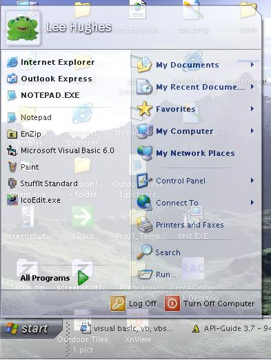



## Transparent Startmenu and Taskbar

### Description

This small program will make your startmenu and taskbar transparent on windows XP and 2000 (you can set a level of transparency 0-255), it can also be compiled and run from a command line e.g. "TransparentTaskbar.exe 180"
 
### More Info
 

             |
---                |---
**Submitted On**   |2003-11-04 15:18:02
**By**             |[Lee Hughes](https://github.com/Planet-Source-Code/PSCIndex/blob/master/ByAuthor/lee-hughes.md)
**Level**          |Beginner
**User Rating**    |4.8 (29 globes from 6 users)
**Compatibility**  |VB 5\.0, VB 6\.0
**Category**       |[Miscellaneous](https://github.com/Planet-Source-Code/PSCIndex/blob/master/ByCategory/miscellaneous__1-1.md)
**World**          |[Visual Basic](https://github.com/Planet-Source-Code/PSCIndex/blob/master/ByWorld/visual-basic.md)
**Archive File**   |[Transparen1667511142003\.zip](https://github.com/Planet-Source-Code/lee-hughes-transparent-startmenu-and-taskbar__1-49662/archive/master.zip)

